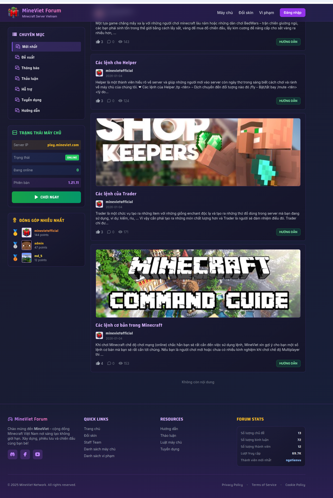

# MCForum

This repository contains the configuration and deployment files for the MineViet forum, powered by [bbs-go](https://github.com/mlogclub/bbs-go).


## Build Docker Image

1. Build site docker image
   ```bash
   make build-docker-site
   ```

2. Build server docker image
   ```bash
   make build-docker-server
   ```

3. Initialize database
   - View server/cmd/initialize/initialize_database_test.go

## Screenshots
